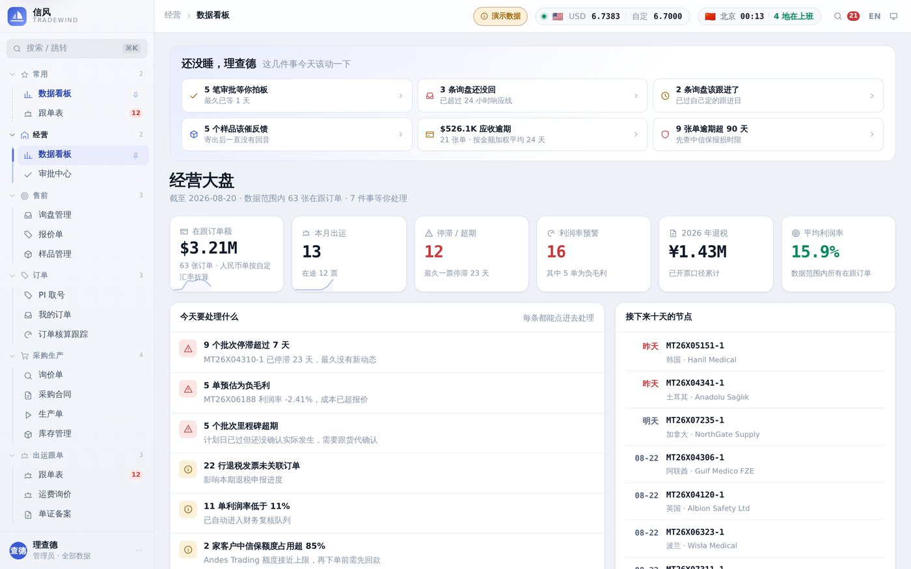
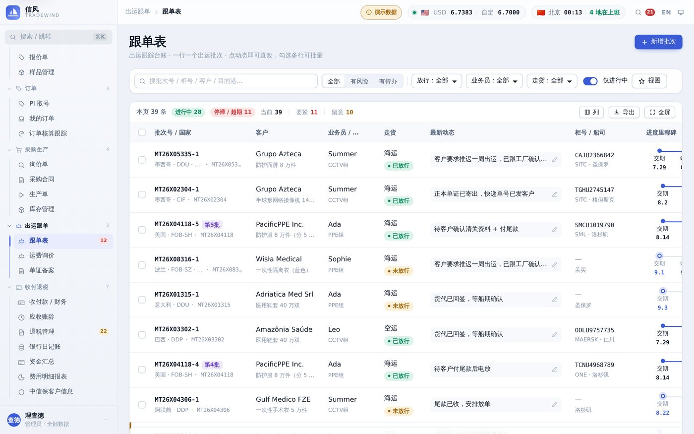
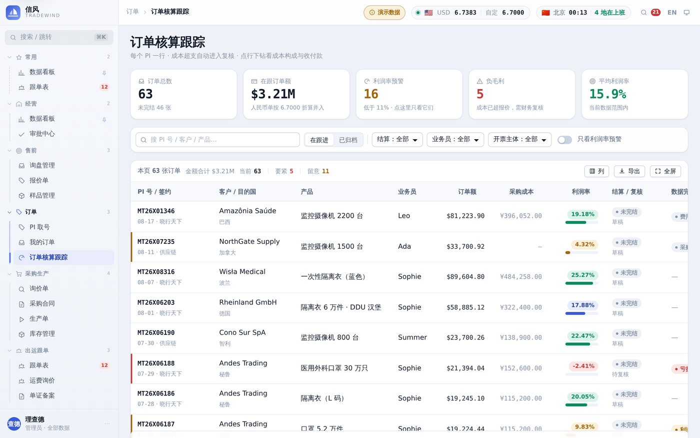
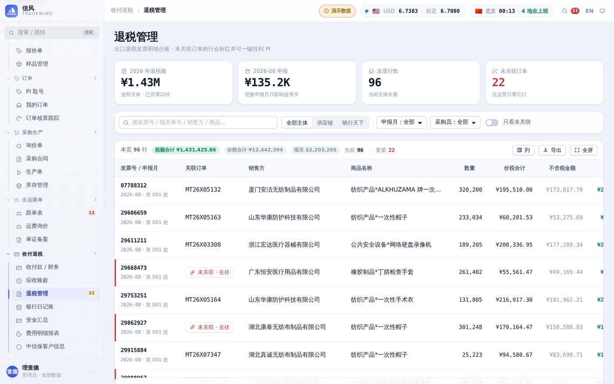

# 信风 · Tradewind

**你的外贸全流程数智化助手** —— 每一票货，全程可见。
询盘、报价、采购、跟单、核算、收汇、退税，一条线走完。

**在线体验 → <https://decli.github.io/ftms/>**（演示账号 `admin` / `demo1234`，进去后左下角可随时换身份）

> **信风** —— 大航海时代，整条欧亚航线都靠这股常年不改向的风。
> 「信」又是信用证的信。中英文指向同一个典故，不用解释。

这一版是**纯静态前端**：没有服务端，没有数据库进程，数据全部在你自己的浏览器里
（IndexedDB）。构建产物是一堆静态文件，扔到 GitHub Pages / 对象存储 / 任何一个
能发文件的地方就能跑，托管费用为零。

- 架构与迁移说明：[`docs/architecture.md`](docs/architecture.md)
- 设计规范（色板、字号、组件、交互约定）：[`docs/design-system.md`](docs/design-system.md)
- 最初的界面与技术选型提案：[`docs/design-proposal.md`](docs/design-proposal.md)
- 早期单文件原型：[`docs/ui-prototype.html`](docs/ui-prototype.html)

---

## 界面

下面五张都是本地跑 `npm run build` 的产物、在 1440×900 下截的真实渲染结果，
数据就是首次打开自动灌的那份演示数据。

**数据看板** —— 一进来先回答「今天该干什么」：待办按类型分组，经营大盘六个数字，
下面是今日要处理的和接下来十天的节点。



**跟单表** —— 出运的主战场。一票货一行，最新动态、单证状态、进港/开船/到港三个日期
和风险提示都在同一行上，不用点进去才知道卡在哪。



**订单核算跟踪** —— 每个 PI 一行，订单额、采购成本、利润率并排；成本超支自动进复核，
点行下钻看成本构成与收付款。



**退税管理** —— 出口退税这段单独一块：发票、报关单、收汇三条线对齐，未关联的挑出来。



**登录页** —— 演示账号已经预填好，进去就行；五个演示身份折在「更多演示身份」后面。


---

## 快速开始

```bash
npm install
npm run dev      # http://127.0.0.1:5173
```

首次打开会自动灌一份演示数据，**28 个模块全部有真实可用的数据**：

| | |
| --- | --- |
| 业务侧 | 24 家客户 · 63 张 PI · 51 个出运批次 · 215 个里程碑 · 96 行退税发票 |
| 采购侧 | 8 家供应商 · 15 个产品 · 14 张询价单 · 34 份采购合同 · 30 张生产单 |
| 资金侧 | 82 笔收付款 · 3 个银行账户 · 9 个会计科目 |
| 物流侧 | 22 个库存批次 · 9 条运费航线 · 按目的国生成的单证清单 |

数据落在浏览器的 IndexedDB 里，关掉页面还在；在「系统设置」里可以随时导出、导入或重灌。

生产构建：

```bash
npm run build    # 产物在 dist/，纯静态
npm run preview  # 本地预览构建产物
```

---

## 登录

演示站默认走账密，口令都是 `demo1234`。挑不同的账号进去能看出**数据范围**的差别：

| 账号 | 姓名 | 角色 | 数据范围 |
| --- | --- | --- | --- |
| `admin` | 理查德 / Richard | 管理员 | 全部数据 |
| `ada` | Ada | 业务员 | 只看本人的单 |
| `summer` | Summer | 业务员 | 看本组（CCTV 组）的单 |
| `finance` | 陈曦 / Sherry | 财务 | 全部数据，可改汇率 |
| `viewer` | 林珊 / Shan | 只读 | 任何写操作都被挡掉 |

登录页默认只摆管理员一个账号 + 一个按钮，其余身份折在「更多演示身份」后面 ——
五个并排列出来，用户第一反应是「我该选哪个」，而不是「进去看看」。
进去之后点左下角头像 →「切换身份」随时换人，用来验证权限。

口令用 PBKDF2-SHA256（12 万轮 + 随机盐）派生后存在本机，不存明文。
也支持自己注册本地账号并选角色 / 数据范围。

> ⚠️ **纯静态站做不了真正的认证。** 没有服务端就没有服务端校验，改改前端代码就能绕过。
> 这里的口令只解决「别让明文躺在别人电脑上」。真实业务请接后端 —— 见
> [`docs/architecture.md`](docs/architecture.md) 的「接回真后端」一节，改一个文件就够。

### 接 Google 登录（可选）

登录页默认不提 Google —— 演示站上它只会让界面变复杂。配了环境变量按钮才会出现：

```bash
VITE_GOOGLE_CLIENT_ID=xxxxx.apps.googleusercontent.com npm run build
```

Client ID 到 [Google Cloud Console](https://console.cloud.google.com/apis/credentials) 建
「Web 应用」类型的 OAuth 2.0 客户端，「已获授权的 JavaScript 来源」填站点源
（本地开发再加一条 `http://127.0.0.1:5173`）。不配也能跑，fork 下来什么都不改即可。

---

## 访问统计（可选）

演示站要回答的问题很具体：**访客走到哪一步就走了。** 是登录页就关掉，
还是进去点了两个模块？有没有人真的走到「导出」和「开始用我的账套」？

```bash
VITE_GA_ID=G-XXXXXXXXXX npm run build:site
```

衡量 ID **已内置**（`G-Y7H2JMNX74`，见 `src/lib/analytics.ts`），不用配也能跑。
它不是密钥 —— 明文写在每个页面的 HTML 里，任何访客按 F12 都看得到，
所以直接写在源码里而不是塞进 secret：塞进 secret 只会让「本机 deploy」和
「CI 构建」各配一次，然后有一天忘了配，数据就悄悄断了。

写死带来的另一个问题（fork 的人一构建就在替别人收数据）用**域名守卫**解决：
内置 ID 只在 `decli.github.io` 上生效，fork 到自己的 github.io 或在 localhost
跑，一行统计脚本都不加载。配了自己的 `VITE_GA_ID` 就是显式选择，不再受域名限制。

### 同域几个站为什么共用一个 property

`decli.github.io` 下现在有四个入口：`/`（门户）、`/ftms/`、`/ems/`、`/wxformat3/`。
四个站共用同一个衡量 ID，而不是各申请一个：

- GA4 靠**域名级**的 `_ga` cookie 认人。一个 property 才能把「从门户点进 ftms、
  退出来又去了 ems」看成**一次会话、一条路径** —— 而那正是做入口页最想知道的事。
- 拆成四个 property 的话，同一个人会被算成四个访客，跨站流向彻底看不到。
- 分站数据不会混：每个站发一个 `site` 参数（`portal` / `ftms` / `ems` / `wxformat3`），
  `page_path` 也带着 `/ftms/` 这样的前缀，报表里按任一维度一拆即可。

> ⚠️ `page_path` 那个前缀是**特意补的**。react-router 的 `pathname` 会剥掉
> basename，`/ftms/follow-ups` 到埋点这儿只剩 `/follow-ups` —— 直接上报的话，
> `/ftms/` 和 `/ems/` 在报表里会挤成同一批路径，共用 property 的前提就塌了。
> 同理 `page_location` 必须是真实地址，拿 `origin + path` 拼出来的是个 404 的 URL。

真要换成自己的 ID：GitHub Actions 走仓库 secret `VITE_GA_ID`，本机构建
在仓库根建个 `.env` 写一行即可（已在 `.gitignore` 里）。

四条硬约定，写在 [`src/lib/analytics.ts`](src/lib/analytics.ts) 的文件头：

| | |
| --- | --- |
| **没配 ID 就什么都不做** | 不是「加载了但不发」，是一行脚本都不下载。fork 的人不会莫名替别人收数据，本地开发也不会往线上打点 |
| **尊重 Do Not Track** | GA 默认不管这个信号，这里主动管。一个卖「数据只在你自己浏览器里」的产品，转头无视用户明说的拒绝，那句宣传就是空的 |
| **不上报任何业务数据** | 事件参数里只有模块名、动作名。客户名、PI 号、金额、邮箱一律不进 GA |
| **SPA 手动报 page_view** | gtag 只在加载那一刻自动报一次，之后换 33 个模块它一无所知 —— 不补这段，看板上会显示「平均每次会话 1 个页面」 |

埋的事件：`login` · `page_view` · `export_xlsx` · `print_document` ·
`print_quote` · `switch_identity` · `switch_profile` · `switch_language`。
其中 `switch_profile{to:live}`（从演示切到自己的账套）是这个站上最接近「转化」的动作。

统计状态在**设置页「关于」里写明**，用户自己看得到 —— 装了统计还不说，
「数据只在你本机」这句话就掉价了。

---

## 模块

侧栏 33 个模块**全部接了真实数据**，没有占位页。

分组按**单据流转顺序**排，不按部门排 —— 新人照着侧栏从上往下走一遍就是一整趟外贸。
一个刻意的例外：**档案**（客户 / 产品 / 供应商）单独一组，它们不是流程的一环，
是流程的输入；混在业务分组里会让人以为「客户管理」是某个步骤。

| 分组 | 模块 | 路由 |
| --- | --- | --- |
| 经营 | 数据看板 · 审批中心 | `/dashboard` `/approvals` |
| 售前 | 询盘管理 · 报价单 · 样品管理 | `/inquiries` `/quotes` `/samples` |
| 订单 | PI 取号 · 我的订单 · 订单核算跟踪 | `/pi` `/my-orders` `/orders` |
| 采购生产 | 询价单 · 采购合同 · 生产单 · 库存管理 | `/rfq` `/purchase-contract` `/production` `/stock` |
| 出运跟单 | 跟单表 · 运费询价 · 单证备案 | `/follow-ups` `/freight` `/documents` |
| 收付退税 | 收付款 · 应收账龄 · 退税管理 · 银行日记账 · 资金汇总 · 费用明细报表 · 中信保客户信息 | `/payments` `/receivables` `/tax-refund` `/bank-journal` `/funds` `/expenses` `/sinosure` |
| 档案 | 客户管理 · 产品管理 · 供应商管理 · PI 卖方档案 · 开票资料 · 账户与科目 | `/customers` `/products` `/suppliers` `/seller-entities` `/invoice-info` `/accounts` |
| 分析 | 报表中心 · 提成与绩效 | `/reports` `/commission` |
| 系统 | 系统设置 · 审计日志 · 登录记录 | `/settings` `/audit` `/logins` |

### 售前 → PI → 出运 → 收款，一条链

```
询盘 ──分配/SLA──▶ 报价（多版本议价）──转──▶ PI ──▶ 采购合同 ──▶ 生产
  │                      │                    │
  └── 寄样 ──催反馈───────┘                    └──▶ 出运 ──▶ 收款 ──▶ 退税
```

PI 详情里的「一单到底」把这条链画成一张图，每个节点可以点进去。
数据本来就是串起来的（`piId` 贯穿全库），这张图只是让用户看见这件事。

### 设计原则：每一页回答一个具体问题

模块不是「把字段列出来」就算做完了。几个例子：

| 模块 | 它要回答的问题 |
| --- | --- |
| **库存管理** | 我还能答应客户多少？—— 给**可用量**（账面 − 已锁定）并写出锁给了哪张 PI。账面 8 万件、锁了 5 万给别的单，再答应 6 万就是超卖 |
| **询价单** | 该定谁？—— 把「便宜 / 快 / 靠谱」摆在一行。定标价高于最低价时算出多花了多少，复盘才说得清 |
| **运费询价** | 这个报价还能用吗？—— 一个月前的运价拿去核今天的成本，算出来的利润率是假的，所以过期报价直接标出来 |
| **单证备案** | 这一票会不会卡在目的港？—— 齐套检查按**目的国**算，韩国要 FORM K、东盟要 FORM E，少一张客户就得按普通税率交关税 |
| **资金汇总** | 下个月的钱够不够付工厂？—— 未来四周滚动结余，看的是**哪一周会破**，不是「30 天总量够不够」 |
| **收付款** | 这笔水单是谁的？—— 一键筛「待认领」，到账但挂不上单据的那几笔是财务每月最花时间的活 |
| **中信保** | 这个客户还能不能再下一单？—— 在跟订单额 vs 剩余额度，而不是只报一个占用率 |
| **提成与绩效** | 我离下一档还差多少？—— 按**利润率**分档不按销售额（按额算，冲量接来的低毛利单反而拿得多），每人显示「再多赚多少能跳档」 |
| **银行日记账** | 跟银行对得上吗？—— 逐笔滚动余额，可直接跟对账单核对 |
| **账户与科目** | 钱花在哪个科目上？—— 科目挂上本期发生额，不是一棵空树 |

### 跟单表

- **里程碑航程线** —— 交期 / 装柜 / 进仓 / ATD / ETA 连成一条带进度填充的线。
  已发生的实心，当前节点带光晕，计划日已过还没确认的转珊瑚红，悬停看「计划 vs 实际」。
  整柜四个节点，拼柜多一个「进仓」。抽屉里两个日期都能就地改。
- **动态就地改** —— 点一下动态就能编辑，常用短语一键填入。动态写成流水，
  同时冗余一份到批次上供列表读取，既有历史又不牺牲列表性能。
- **批量更新** —— 勾选多行（支持 Shift 连选），底部升起操作条，一次写完动态 + 日期 +
  放行状态，**带撤销**。
- **详情抽屉** —— 概览 / 动态流水 / 单证齐套三个标签；宽度可拖并记住；`J` / `K` 上下换票。
- **停滞与超期识别** —— 超过 7 天没有新动态标「停滞 N 天」，里程碑超期标红并计入表头统计。
- **软删除 + 撤销** —— 「删除」置 `archived` 而不是真删；外贸单据要留痕，也才撤销得回来。

### 数据看板

- 六张 KPI（带迷你趋势）+ 月度出运与签约额组合图 + 目的国 TOP + 业务员业绩 + 利润率分布
- 「今天要处理什么」清单：停滞、超期、负毛利、退税未关联、额度超限、未销待办，
  每条都能跳到能处理它的页面
- 「接下来十天的节点」时间线
- 图表是手写 SVG，没有图表库依赖

---

## 中英文一键切换

顶栏 `EN / 中`，任何页面都能切，选择记住。

**用中文原文当 key**，而不是 `page.followups.title` 这种符号：

1. 漏翻的降级结果是显示中文 —— 不会出现 `page.foo.title` 这种事故字符串出现在生产页面上；
2. 代码里读得懂 —— `t("停滞 / 超期")` 一眼知道在说什么，符号 key 要跳到词条表才看得出；
3. 加一个中文页面时不需要先想 key 名，写完中文再补英文即可。

代价是中文文案改动会失配一次翻译。对一个中文优先的产品，这个交换划算。

覆盖范围：全部 28 个模块的正文、菜单、面包屑、表格分页、看板的风险清单、
导出的 Excel 表头。**数据本身（客户名、供应商名、备注）保持原样** —— 那是数据不是界面。

名字本身也是双语的，切语言时两行对调而不是只换一行：

```
中文界面   信风 / TRADEWIND
英文界面   Tradewind / 信风
```

只把主行换成 Tradewind 的话，副行还是 TRADEWIND —— 同一个词写两遍。
让副行始终摆「另一种写法」，两个方向都成立，也说明了这两个名字是一回事。

---

## 这一版新补的能力

站在「卖给外贸公司」的角度补的，每一项都对应一个真实痛点。

| 能力 | 解决什么 | 关键文件 |
| --- | --- | --- |
| **售前漏斗** | 系统原来从 PI 开始，而业务员八成时间花在 PI 之前 | `pages/presales.tsx` |
| **报价核算器** | FOB/CIF/DDP 正算利润、反算报价；退税按含税价 ÷1.13 算 | `lib/quote-calc.ts` |
| **议价轨迹** | 同一报价号多版本，让价理由和利润率变化一列排开 | `presales-queries.ts` |
| **PI 商品明细行** | 原来只有一句话产品描述，开不出发票和装箱单 | `types.ts` `PiLine` |
| **出口单据** | PI / 商业发票 / 装箱单，浏览器直接打印成 PDF | `lib/docs.ts` |
| **应收账龄** | 谁欠我多少、欠了多久；账期从提单日起算 | `flow-queries.ts` |
| **审批流** | 低价单、特价、超额度、大额付款，谁批的都留痕 | `pages/approvals.tsx` |
| **通知中心** | 预警要追着人跑，不能躺在页面里等人打开 | `lib/notify.ts` |
| **附件** | 盖章 PI、水单、提单挂到单据上 | `data/files.ts` |
| **数据导入** | 期初建账刚需；从 Excel 直接粘贴，导前先试运行。客户 / 产品 / 供应商三页在**一条数据都还没有**时，空状态直接把人送进对应的那张导入表（`/settings?import=customer`）—— 引导第 2 步原本把人送到客户页，而那一页既没有新建入口，空状态还写着「换个关键词试试」 | `ImportWizard.tsx` |
| **本地备份** | 清一次浏览器数据不能让三年台账消失 | `data/backup.ts` |
| **多标签页同步** | 协同机制跑通，缺的只有网络那一段 | `data/sync.ts` |
| **字段级权限** | 业务员看得见售价，看不见采购底价（有个必须讲在前头的口子，见「从这一版走到生产」） | `lib/perms.ts` |
| **自定义字段** | 每家公司总有两三个自己的字段 | `flow-types.ts` |
| **一单到底** | 八个页面的数据接成一条可点的链路 | `OrderTimeline.tsx` |
| **角色化首页** | 老板看钱，业务员看今天该干什么 | `RoleBand.tsx` |

### 商用前必须补的六件（已完成）

前五件是「掏钱的人第一个月会在哪里受伤」，第 0 件是它们的前提 ——
不先修，后面每加一张表就毁一次用户数据。

| 能力 | 解决什么 | 关键文件 |
| --- | --- | --- |
| **账套迁移阶梯** | 原来「版本对不上就重灌」＝ 静默销毁用户账套 | `data/db.ts` |
| **存储持久化** | 没申请 persist，Safari 7 天不访问就清空 | `lib/storage-health.ts` |
| **演示 / 我的账套** | 买家打开是 63 张假单，没有通往自己数据的路 | `data/profile.ts` |
| **分批出运明细** | 给第 4 批开的发票打的是整张 PI 的数量，那张纸要拿去清关 | `data/shipment-lines.ts` |
| **报价单 / 合同 + 签章** | 客户收到的报价单还是手拼的 Excel；没盖章的 PI 客户财务不认 | `presales/QuoteSheet.tsx` |
| **结构化收款计划** | 付款方式是一句自由文本，账龄只能一刀切，定金一定算错 | `data/payment-terms.ts` |

## 界面上花了力气的地方

### 信息密度下的可操作性

| | |
| --- | --- |
| **表头 / 列头冻结** | 滚到第 80 行仍看得到列名；横向滚动时批次号那一列不动，对得上行。冻结边界滚出去才亮阴影 |
| **贴视口底的横向滚动条** | 宽表的滚动条长在容器底边上，页面一滚就出视口。表格底边被挤出去时，视口底部浮出一条等宽代理条，双向同步；底边重新可见就自动收起。**指针靠近时滚轮直接横滚**，不用瞄准去拖 |
| **交叉高亮** | 悬停时行和列同时点亮，两条线在鼠标那格交汇 —— 宽表横向滚过去最容易看串行 |
| **列宽可拖、列可隐藏** | 每列都能拖宽（双击还原到最窄），「列」菜单里可隐藏；宽度、隐藏、排序按表分别记住 |
| **常驻滚动条** | macOS 默认的覆盖式滚动条会让人根本不知道右边还有内容，全站换成常驻细滚动条 |
| **表格密度** | 紧凑 / 标准 / 宽松三档，行高与内边距整体联动 |
| **保存的视图** | 筛好的条件可以存下来复用；筛选条件全部写进 URL，刷新不丢，也能直接发给同事 |

### 顶栏与外观

| | |
| --- | --- |
| **五套主题色一键换** | 航线蓝 / 远洋蓝 / 松石绿 / 暮山紫 / 墨石。令牌拆成「调色板层 + 语义层」，加一套色只是加一个五行的块，明暗与配色两个维度自由组合。选色受两条硬约束：**不能撞上状态色的色相**（绿橙红在这套系统里已经有工作了），且每一档彩度都收在 sRGB 色域内 |
| **世界时间：一张时区对照表** | 原来六个城市平铺占掉四百多像素。真正要答的问题不是「几点」而是「现在能不能打过去」—— 现在顶栏只留「本地国旗 + 城市 + 时间 + 几地在上班」，悬停展开一条以**你的**一天为横轴的对照带：色块是对方 9:00–18:00 落在你钟上的位置，竖线是此刻，本地那行虚线描边作参照。本地城市默认取浏览器时区，40 个城市自己加减，换本地整条轴跟着换 |
| **周末跟国家走，不跟时区走** | 沙特、埃及是周五 + 周六，伊朗是周四 + 周五，阿联酋 2022 年才改成六日。休息日整行压暗、色块换成斜纹，并写出是星期几 —— 只说「休」的话，中国用户看到周末会顺手以为全世界都在休，而利雅得的周日恰恰是工作日 |
| **汇率牌价：盯什么、多久刷一次自己定** | 顶栏一条牌价，悬停展开全表。31 种货币自己加减，刷新节奏 30 秒 / 1 分钟 / 5 分钟 / 15 分钟 / 手动。每行一条 42×15 的迷你趋势线（只画折线和末端点，不画坐标轴 —— 它只回答「在往上还是往下」）。涨跌用箭头 + 颜色两个通道 —— 红涨绿跌是中文金融界面的读法，但它跟站内「珊瑚 = 有问题」撞车，所以方向由箭头说。牌价不联网，以账套里的市场汇率为锚推算，面板底部写明是演示行情 |
| **国旗不下载任何资源** | 币种和城市都带国旗，用的是 Unicode 区域指示符（🇺🇸 = 两个码点），系统字体渲染 —— 七十来面旗的 SVG 是几百 KB 或者一个新依赖。Windows 没有旗帜字形，所以先用 canvas 量一次宽度探测，没有就退回两位国别码色块 |
| **悬停即展开，点过才钉住** | 这两个面板是「看一眼就走」的东西，为此点两次是白付的。但里面有增删按钮，纯悬停会变成手一抖就没。所以：悬停是给「看」的，点击是给「改」的 —— 在面板里点过任何东西就钉住，只有点外面或 Esc 才关 |
| **外观合成一个入口** | 明暗、主题色、表格密度都是「装修时设一次」的开关，却各占一个顶栏按钮。合并后顶栏从四个控件降到三个，里面用三排分段器，当前值一眼看见 |

### 导航：任何时候都知道自己在哪

| | |
| --- | --- |
| **层级导线** | 子项左边一条竖线挂在分组头下面，选中条正好长在这条线上 —— 从分组头一路看到当前项 |
| **折叠也不丢方位** | 分组收起后那个链接压根没渲染，`aria-current` 帮不上忙。所以分组头自己会亮起来并显示一个圆点：「你在这儿，只是收起来了」 |
| **三角在左边** | 跟子项图标错开一档，层级从缩进就读得出来。放右边时它离标题太远，扫视时注意不到 |
| **常用 = 快捷方式不是位置** | 同一个页面在常用和它本来的分组里各出现一次。常用那份用淡一档的选中样式 + 虚线导线，「当前位置」全站只有一个 |
| **侧栏三形态** | 展开（宽度可拖 200–380，记住）/ 收成 64px 图标轨（hover 出气泡）/ 窄屏浮层。`[` 切换 |
| **⌘K 命令面板** | 一个入口搜三类东西：模块（去哪）、单据（找什么）、动作（做什么） |

### 微交互

原则是**只在指针停在上面时给回应，动作短、幅度小**。看板上同时摆着六张卡、
几十行数据，任何一个元素动得太大都会把注意力抢走 —— 反馈是为了确认「我指的是这个」，
不是为了表演。

- **看板卡片的光晕跟着鼠标转** —— 三层叠出来：跟着指针走的聚光、用 mask 只留 1.2px
  描边的边缘高光（亮的那段边框始终朝着鼠标）、整卡朝指针那侧压下去最大 3.2°。
  带色调的卡（预警红 / 达标绿）光晕跟着自己的颜色走，不然红卡会亮出一圈蓝边。
- **图表** —— 悬停那组提亮其余压暗；柱子矮的时候加了一条贯穿全高的透明命中区，
  不然只有几像素高，鼠标根本对不上。
- 位移一律 ≤3px，时长 110–180ms，全部走 `prefers-reduced-motion` 兜底。

### 其它

| | |
| --- | --- |
| **响应式** | ≥900px 双栏；&lt;900px 侧栏转浮层；&lt;768px 表格整体换成卡片流，不做横向滚 |
| **「第 N 批」不折行** | 批次号可截断，分批标签整块不换行 —— 这类标签被拆成两行是最刺眼的排版事故 |
| **撤销** | 所有破坏性操作 6 秒内可撤销，提示条上画一圈倒计时，而不是写「5 秒内可撤销」 |
| **键盘** | `⌘K` 搜索 · `[` 收侧栏 · `N` 新增 · `F` 聚焦搜索 · `↑↓` 选行 · `↵` 打开 · `空格` 勾选 · `J/K` 抽屉换票 |
| **无障碍** | 跳转到主内容、`:focus-visible` 焦点环、`aria-sort` / `aria-current` / `aria-live`、按钮全部有可读名称、尊重 `prefers-reduced-motion` |
| **打印** | 单据是「只印这一张」（整页藏起来，只放行 `.doc-sheet`），其余页面是「印你看到的」（撤掉侧栏顶栏与按钮，表格摊平，版权行印在末尾）。两件事共用一条规则的后果是：在看板上按 ⌘P 出来一张**全白的纸**，没有报错也没有提示 |
| **版权署名** | 登录页页脚、登录后每一页末尾、设置页「关于」三处。邮箱**画在 canvas 上**，不以文本节点、不以源码字面量、不以 `aria-label` 出现 —— 贴在公开网页上的邮箱半天之内就会进入群发名录。整块可点击复制，读屏用户拿到的是可粘贴的真地址，而爬虫不会去点按钮。见 [`src/components/Copyright.tsx`](src/components/Copyright.tsx) |
| **输入法** | 受控输入框在中文输入法下不会被打断。值走地址栏参数的框曾经**只能打英文** —— 原因不在输入法，在于 react-router 的 `startTransition` 让更新延后一帧提交，React 在事件收尾时把 DOM 的 `value` 写回旧值，而那对输入法就等于「合成结束」。见 [`docs/architecture.md` 第 9 节](docs/architecture.md) |

---

## 三条硬约定

**1. 金额一律用整数「分」存。** 浮点会让订单核算和退税凑不平账。所有金额字段是
以「分」为单位的整数，汇率存 6 位小数的整数（`6.7392` → `6739200`），
只在展示层格式化 —— 见 `src/lib/format.ts`。

**2. 币种口径必须写清楚。** 应收类字段记的是 **PI 币种**（多数美元），
费用与采购成本记的是**人民币**。混着相加是这类系统最常见的错，而且只在跨模块汇总时
才暴露 —— 单页看每个数都对。凡是要放在一起比的地方，代码里都显式折算并注明口径。

**3. 视图模型的字段名跟原后端保持一致。** 查询层（`src/data/queries.ts`）是原来
`src/server/*` 的平移，返回结构没变。将来接回真后端，页面组件一行都不用改。

---

## 目录结构

```
src/
  data/                账套：类型、种子、IndexedDB、查询、写操作
    types.ts           数据模型（由原 Prisma schema 平移）
    seed.ts            演示数据（时间轴跟着「今天」走）
    ops-types.ts       采购协同 / 资金 / 库存 / 单证 / 登录的数据模型
    ops-seed.ts        上述模块的演示数据，全部挂回已有的 PI
    ops-queries.ts     上述模块的查询与视图映射
    idb.ts             极小的 IndexedDB 封装
    db.ts              内存账套 + 防抖持久化 + 订阅
    queries.ts         查询与视图映射（原 src/server/*）
    mutations.ts       写操作，每次落一条审计留痕
  i18n/                中英切换：Provider、useT/tr、以中文原文为 key 的词条表
  auth/                Google 登录 / 账密 / 口令派生 / 角色与数据范围
  components/
    Brand.tsx          名字、Logo、口号：只定义一次，其余地方引用
    BrandWind.tsx      登录页的风场动画（纯 CSS 位移，不用 SMIL）
    shell/             侧栏、顶栏、⌘K 命令面板
    grid/
      DataGrid.tsx     冻结表头列、列宽拖拽、密度、排序、分页、卡片视图、交叉高亮
      StickyXScroll.tsx 贴视口底的横向滚动条 + 滚轮就近横滚
    ui/                Toast / Menu / Drawer / Modal / PageKit / 基础件
    MilestoneRail.tsx  里程碑航程线（签名组件）
    charts.tsx         手写 SVG 图表
  pages/               各模块页面（sourcing / finance / logistics / admin 按簇分文件）
  lib/                 格式化 / 业务规则 / 信息架构 / hooks / 主题 / 光晕跟随 / xlsx 导出
  styles/              设计令牌与组件样式（tokens / base / ui / shell / grid / pages）
```

---

## 技术栈

Vite 7 · React 19 · TypeScript · react-router 7 · IndexedDB · write-excel-file ·
手写 CSS 设计令牌

**不引入**：UI 组件库、CSS 框架、图表库、状态管理库、动画库、i18n 库、后端。
首屏只加载看板与跟单表，其余模块按簇懒加载。

---

## 部署

推到 `main` 就自动上线 —— `.github/workflows/deploy.yml` 构建并发布到
**本仓库自己的项目站点** <https://decli.github.io/ftms/>。没有别的步骤。

```bash
npm run build        # 本地构建（base = /）
npm run build:site   # 按线上路径构建（base = /ftms/）
npm run preview      # 预览构建产物
```

**base 从仓库名算，不写死。** 项目站点的路径就是仓库名，一字不差、不能自选 ——
所以这个仓库叫 `ftms`，地址才是 `/ftms/`。写死 `--base=/xxx/` 的话，仓库一改名，
产物里所有资源路径就全指向旧路径：页面打得开，CSS 和 JS 全 404，而且构建是绿的，
没人会去看。流水线改成从 `github.event.repository.name` 取，改名当天自动跟上。
canonical / og:url / sitemap 里的绝对地址同理（`VITE_SITE_ORIGIN` / `VITE_SITE_PATH`）。

### 站点全貌

`decli.github.io` 域名下每个项目都是**独立仓库的项目站点**，各自发各自的，
互不依赖：

| 地址 | 来自 |
| --- | --- |
| `/` | [decli/decli.github.io](https://github.com/decli/decli.github.io)（首页） |
| `/ftms/` | **本仓库** |
| `/ems/` | [decli/ems](https://github.com/decli/ems) |
| `/wxformat3/` | [decli/wxformat3](https://github.com/decli/wxformat3) |

> 早期这个项目是用一个 `deploy-user-site.mjs` 脚本把产物推到
> `decli.github.io` 仓库的子目录里的。改成项目站点之后那套跨仓库部署整个不需要了，
> 脚本已删。一个项目一个仓库，谁也不用去动别人的仓库。

GitHub Pages 没有服务端，刷新 `/ftms/follow-ups` 这种深链接会 404。构建时会把
`index.html` 再拷一份成 `404.html`，Pages 找不到路径时回落到它，SPA 路由读
`location.pathname` 就能正确渲染 —— URL 保持干净，不用 hash 路由。
站点根还有第二道保险，见 `decli.github.io` 仓库的 `404.html`。

### SEO / GEO

| | |
| --- | --- |
| **meta 与分享卡片** | title / description / keywords / canonical / hreflang / Open Graph / Twitter Card 齐全，`public/og.png` 是 1200×630 的分享图 |
| **结构化数据** | `SoftwareApplication` + `Person` + `WebSite` + `FAQPage` 四段 JSON-LD。FAQ 是照着「潜在用户真会问什么」写的，包括「业务员能不能看到采购底价」这种不好回答的 |
| **sitemap 与 llms.txt** | 都由 `vite.config.ts` 的 `ROUTES` 生成，一处定义两处输出 —— 手写的清单跟路由表一定会分叉，然后 sitemap 里躺着几条 404 |
| **给不执行 JS 的抓取器的正文** | Googlebot 会跑 JS，看得到 React 渲染的界面；GPTBot / ClaudeBot / PerplexityBot 多数**不执行 JS**，看到的就是一个空 div。`index.html` 里的 `<noscript>` 段和 `/llms.txt` 是它们唯一读得到的内容，所以那里写的是真话和干货，不是关键词 |

> ⚠️ 爬虫只读**站点根目录**那份 `robots.txt`。本项目在子目录下，线上是
> `/ftms/robots.txt`，没有爬虫会去读 —— 所以 sitemap 的登记落在
> [decli/decli.github.io](https://github.com/decli/decli.github.io) 那份根
> `robots.txt` 里（已配好）。加新项目时记得同步加一行。
> 本仓库 `public/robots.txt` 留着是为了 fork 到自己域名根目录时开箱即用。

---

## 从这一版走到生产

这个演示版**不能**直接用在真实业务上。说清楚做到了什么、没做到什么：

| | 状态 |
| --- | --- |
| 本地备份与回滚 | ✅ 每天自动一份，保留 7 天，可回滚（回滚前再备一份） |
| 多标签页实时同步 | ✅ 同机多个标签页无刷新同步，冲突规则：最后写入者胜 |
| **多台电脑共享数据** | ❌ 纯静态托管没有服务端。接口已留好（`data/sync.ts` 的 `SyncAdapter`） |
| **服务端校验与真会话** | ❌ 权限判断都在浏览器里 —— 字段级权限挡的是「看一眼屏幕」和「顺手导出」，不是加密 |
| **业务员反推采购成本** | ⚠️ 挡不住。订单列表上成本打了码、**利润率没有**，而 `成本 = 订单额 ×(1 − 利润率)` 一步就算得出来。不挡利润率是因为提成按利润率分档，业务员看不到自己的利润率那条规则就废了 —— 两害相权的结果，不是疏漏。这道墙真正挡住的是**别人的**成本：他导不出一张全公司的成本表 |
| 附件 | ✅ 存本机 IndexedDB。换电脑不跟着走 |
| 邮箱同步 | ❌ 需要 IMAP/OAuth 和常驻服务。往来记录目前是手工归档，数据结构按同步设计 |

要上生产，见 [`docs/architecture.md`](docs/architecture.md) 第 6 节 ——
换掉一个文件即可，查询与页面代码不动。

## 后续排期

前端形态已经完整，剩下的都在「接回真后端」这条线上。

| 阶段 | 内容 |
| --- | --- |
| M1 | 接回服务端（Prisma + SQLite/MySQL）与真正的会话认证；`SyncAdapter` 换成 WebSocket |
| M2 | 附件与单据落对象存储；`putBlob/getBlob` 换成签名 URL |
| M3 | 邮箱同步（IMAP/OAuth），往来记录自动归档到客户与订单下 |
| M4 | 多人并发：从「最后写入者胜」换成 op 级合并 |
| M5 | 真实数据源：汇率行情、船司/17TRACK 物流轨迹、年度退税率库 |
| M6 | 信用证 L/C（交单期、效期、不符点）与批次级损益 |
